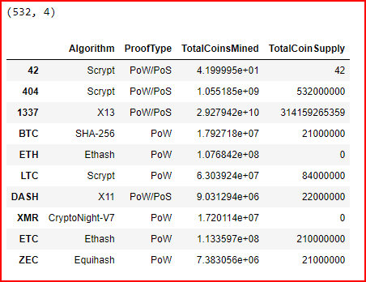
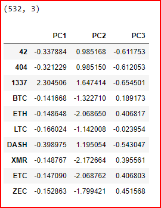
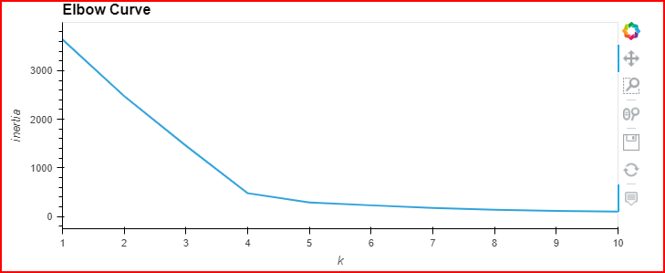
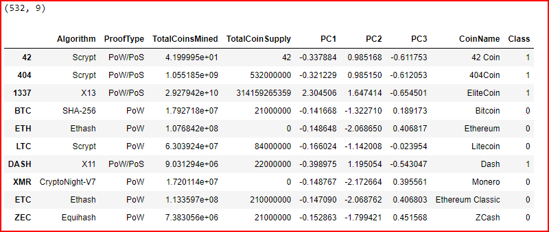
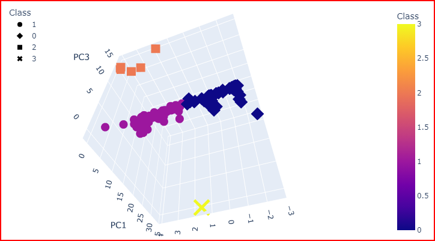
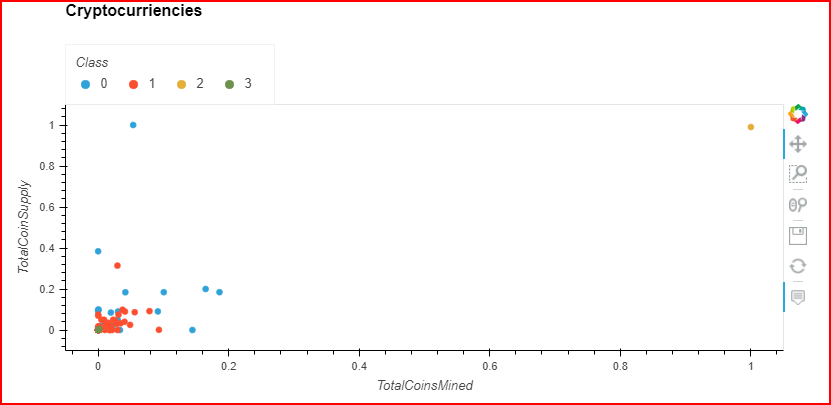
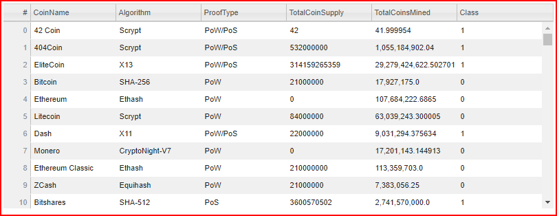

# Cryptocurrencies

## Project Overview

A very important banking client is interested in offering a new cryptocurrency investment portfolio for its customers. The company, however, has some reservations about undertaking this challenge as they do not have a good handle on the universe of cryptocurrencies. So, they’ve tured to us and have requested a report on what cryptocurrencies are available on the trading market and how they could be grouped to create a classification system for this new investment.

The data we will be working with does not support our needs exactly, so it needs to be processed to fit the different machine learning models. As this is an exploratory endevour, we are not sure of the expected results, as such, we have decided to use unsupervised machine learning and specifically Principal Component Analysis(PCA). In order to group the cryptocurrencies, we have decided to utilize a clustering algorithm. Also, we will be using data visualizations to share the findings with the board.

Deliverables:
1. Preprocessing the Data for PCA
2. Reducing Data Dimensions using PCA
3. Clustering Cryptocurriencies Using K-means
4. Visualizing Cryptocurrencies Results

------------------------------------------------------------------------------------------------------------

## Resources

- Software: Visual Studio Code 1.56.2, Python 3.7.10, Jupyter Notebook Server 6.3.0
- Browser : Google Chrome v91.0.4472.124
- Libraries: scikit-learn v0.24.2, hvplot v0.7.2, plotly v5.3.1

------------------------------------------------------------------------------------------------------------

## Results
- Below we can see the different steps undertaken to get to the final result

### Preprocessing Crypto Data

### Data Dimension Reduction using PCA

### Elbow Curve showing Optimal Clustering

### Final Chart with PCA Data and Clusters

### Scatter Plot showing Clusters

### Interactive Crypto Chart

------------------------------------------------------------------------------------------------------------

## Overall Summary

- As shown below we have been able to identify the different cryptocurrencies that are available for further investigation. The chart plots the current coin supply versus coins mined, which gives us a great representation of availibility in the marketplace. The results show that we have 532 different cryptocurrencies to choose from with a general low level of supply.

### Report Showing Crypto Currencies

